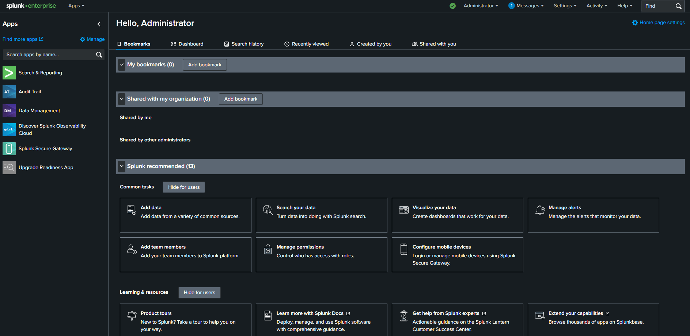
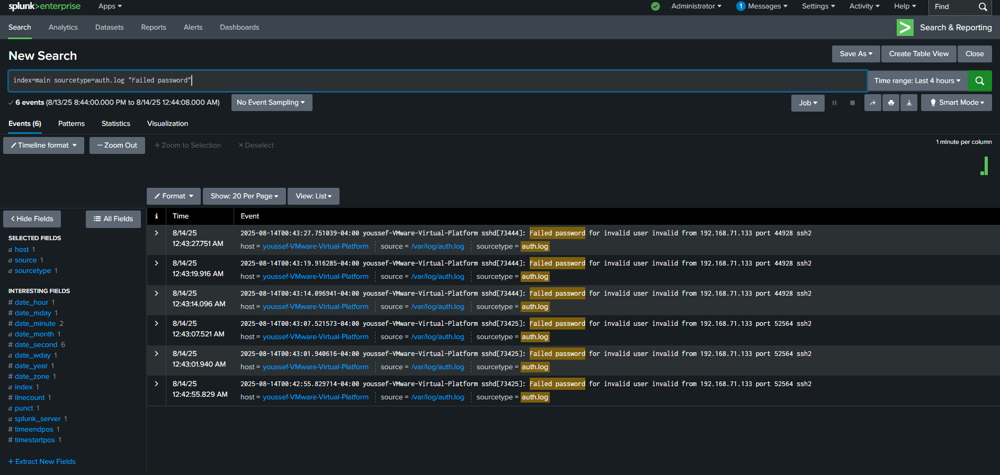
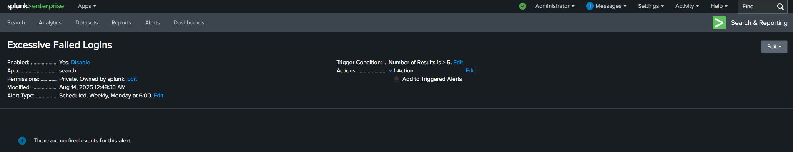
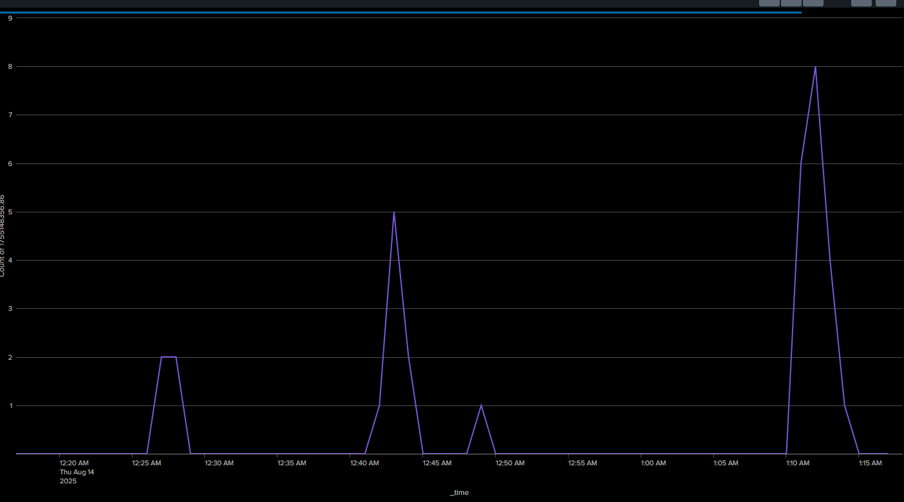
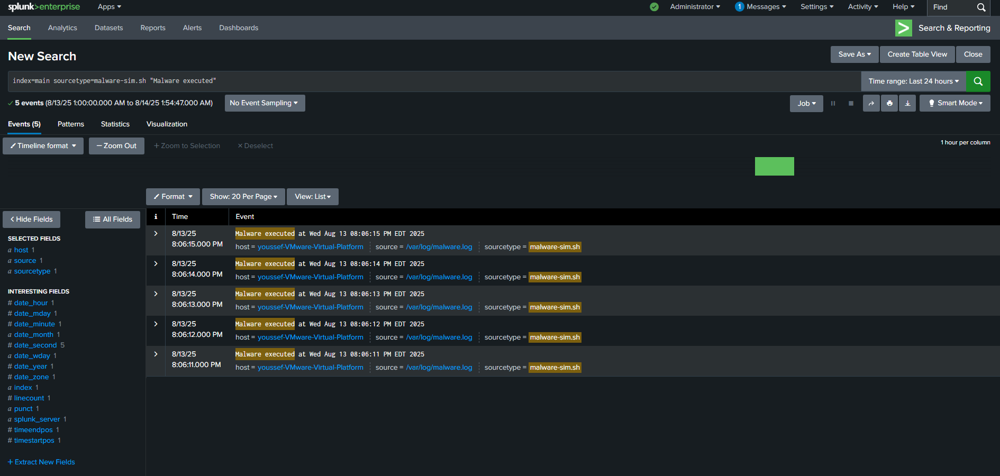
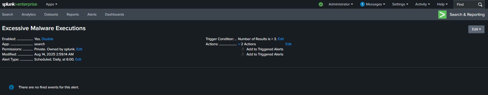
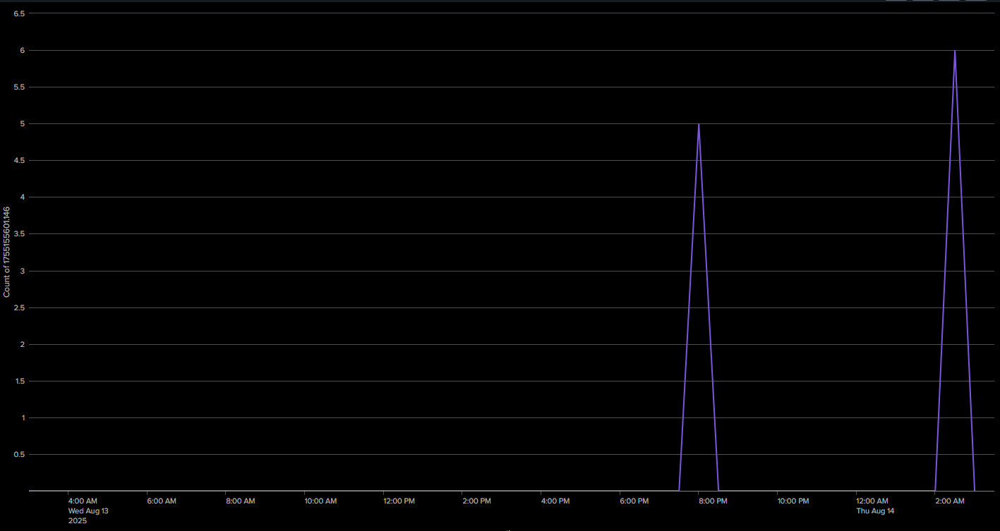
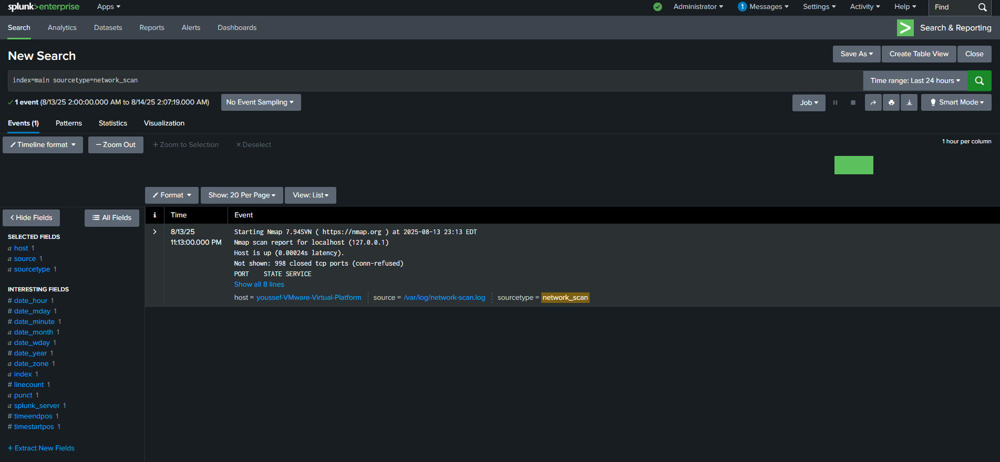
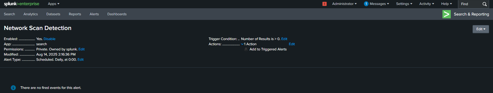
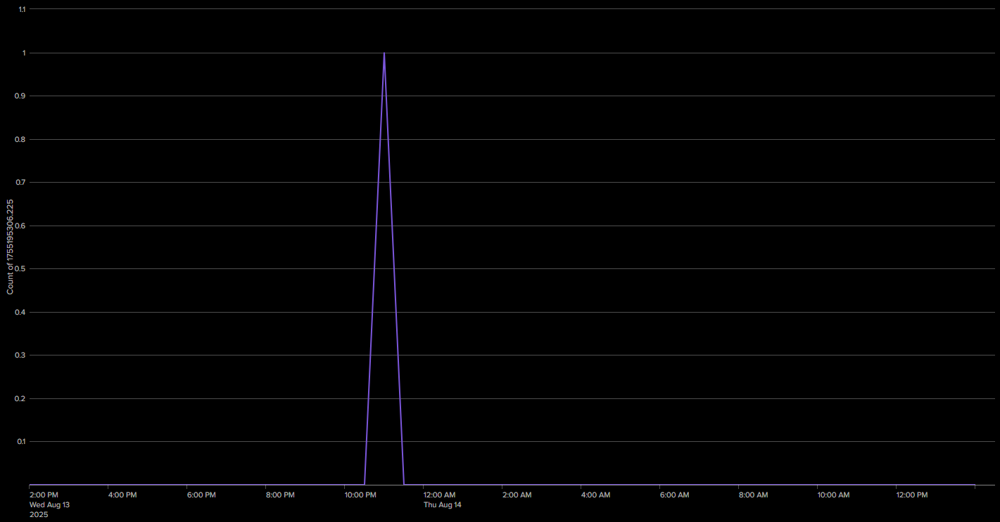

# SIEM Threat Hunting Lab

A hands-on SIEM lab using **Splunk Enterprise** to simulate, detect, and analyze real-world cyber threats in a controlled environment. Built to demonstrate SOC analyst and detection engineering skills aligned with **CompTIA Security+ Domain 2** (Threat Detection and Monitoring).

> **Author:** Youssef Elmanawy | 4th-Year CS @ Queen's University | CompTIA Security+ Certified
>
> **LinkedIn:** [youssef-elmanawy](https://www.linkedin.com/in/youssef-elmanawy/) | **Email:** [yhmanawy@gmail.com](mailto:yhmanawy@gmail.com)

---

## Table of Contents

- [Architecture](#architecture)
- [Detection Coverage](#detection-coverage)
- [Results at a Glance](#results-at-a-glance)
- [Repository Structure](#repository-structure)
- [Getting Started](#getting-started)
- [Threat Simulations](#threat-simulations)
- [Screenshots](#screenshots)
- [Skills Demonstrated](#skills-demonstrated)
- [Lessons Learned](#lessons-learned)
- [Future Roadmap](#future-roadmap)

---

## Architecture

```
┌──────────────────────────────────────────────────────────────────┐
│  Host: Windows 11 + VMware Workstation Pro                       │
│                                                                  │
│  ┌────────────────────────────────────────────────────────────┐  │
│  │  VM: Ubuntu 24.04 LTS (8 GB RAM, 50 GB disk, NAT)        │  │
│  │                                                            │  │
│  │  ┌──────────────┐    ┌─────────────────────────────────┐  │  │
│  │  │  Threat       │    │  Splunk Enterprise (Free)       │  │  │
│  │  │  Simulations  │───>│  http://192.168.x.x:8000       │  │  │
│  │  │              │    │                                 │  │  │
│  │  │  - SSH Brute │    │  Data Inputs:                   │  │  │
│  │  │    Force     │    │  ├─ /var/log/auth.log           │  │  │
│  │  │  - Malware   │    │  ├─ /var/log/malware.log        │  │  │
│  │  │    Sim       │    │  └─ /var/log/network-scan.log   │  │  │
│  │  │  - Nmap Scan │    │                                 │  │  │
│  │  └──────────────┘    │  Outputs:                       │  │  │
│  │                       │  ├─ SPL Hunt Queries            │  │  │
│  │                       │  ├─ Scheduled Alerts            │  │  │
│  │                       │  └─ Dashboard Visualizations    │  │  │
│  │                       └─────────────────────────────────┘  │  │
│  └────────────────────────────────────────────────────────────┘  │
└──────────────────────────────────────────────────────────────────┘
```

---

## Detection Coverage

| # | Detection Rule | MITRE ATT&CK | Tactic | Data Source | Threshold |
|---|---------------|--------------|--------|-------------|-----------|
| 1 | [Excessive Failed Logins](detections/excessive-failed-logins.spl) | T1110 - Brute Force | Credential Access | `auth.log` | > 5/min |
| 2 | [Excessive Malware Executions](detections/excessive-malware-executions.spl) | T1059, T1204 | Execution | `malware.log` | > 3/min |
| 3 | [Network Scan Detection](detections/network-scan-detection.spl) | T1046 - Network Service Discovery | Discovery | `network-scan.log` | Any match |

All detection rules are available as standalone SPL files in the [`detections/`](detections/) directory with inline documentation explaining the query logic.

---

## Results at a Glance

| Metric | Value |
|--------|-------|
| Threat categories covered | 3 |
| Simulated attack events | 15+ |
| True positive rate | 100% (3/3 detections) |
| Mean time to detect | < 1 minute |
| Peak failed-login burst | 6+/minute |
| Malware execution burst | 5 in ~5 seconds |
| Ports scanned | 65,535 (full TCP) |

---

## Repository Structure

```
SIEM-Threat-Hunting-Lab/
├── detections/                          # Splunk detection rules (SPL)
│   ├── excessive-failed-logins.spl          # SSH brute-force detection
│   ├── excessive-malware-executions.spl     # Malware burst detection
│   └── network-scan-detection.spl           # Nmap recon detection
├── scripts/                             # Threat simulation scripts
│   ├── simulate-brute-force.sh              # Generate failed SSH logins
│   ├── simulate-malware.sh                  # Simulate malware execution burst
│   └── simulate-network-scan.sh             # Run Nmap port scan
├── captures/                            # Raw log samples (evidence)
│   ├── auth-log-sample.txt                  # Failed SSH login entries
│   ├── malware-log-sample.txt               # Malware execution log entries
│   └── network-scan-log-sample.txt          # Nmap scan output
├── reports/
│   └── threat-hunting-report.md         # Full analysis with MITRE mappings
├── docs/
│   └── setup-guide.md                   # Lab environment setup instructions
└── screenshots/                         # Splunk UI evidence
    ├── splunk-setup/
    ├── authentication-failures/
    ├── malware-activity/
    └── network-scanning/
```

---

## Getting Started

### Prerequisites

- VMware Workstation Pro (or VirtualBox)
- Ubuntu 24.04 LTS ISO
- Splunk Enterprise Free Trial ([download](https://www.splunk.com/en_us/download.html))

### Quick Start

```bash
# 1. Clone the repository
git clone https://github.com/ymangt/SIEM-Threat-Hunting-Lab.git
cd SIEM-Threat-Hunting-Lab

# 2. Follow the setup guide to build the VM + Splunk environment
#    See: docs/setup-guide.md

# 3. Run the threat simulations
sudo bash scripts/simulate-brute-force.sh
sudo bash scripts/simulate-malware.sh
sudo bash scripts/simulate-network-scan.sh

# 4. Open Splunk and run the detection queries from detections/*.spl
```

For the full step-by-step setup, see the [Setup Guide](docs/setup-guide.md).

---

## Threat Simulations

### 1. SSH Brute-Force Attack

Simulates a credential-stuffing attack with rapid failed SSH logins using multiple usernames.

```bash
sudo bash scripts/simulate-brute-force.sh 127.0.0.1 8
```

**What to look for in Splunk:**
```spl
index=main sourcetype=auth.log "Failed password"
```

| Detail | Value |
|--------|-------|
| Events generated | 13+ failed login attempts |
| Attack window | 00:42:55 - 00:43:28 EDT |
| Source IP | 192.168.71.1 (host via NAT) |
| MITRE mapping | T1110 - Brute Force |

### 2. Malware Execution Burst

Simulates automated malware or dropper activity by rapidly writing execution entries to a log file.

```bash
sudo bash scripts/simulate-malware.sh 5
```

**What to look for in Splunk:**
```spl
index=main sourcetype=malware-sim.sh "Malware executed"
```

| Detail | Value |
|--------|-------|
| Events generated | 5 executions |
| Attack window | 20:06:11 - 20:06:15 EDT (~5s) |
| MITRE mapping | T1059, T1204 |

### 3. Network Reconnaissance (Port Scan)

Simulates attacker reconnaissance using a full TCP SYN scan.

```bash
sudo bash scripts/simulate-network-scan.sh localhost
```

**What to look for in Splunk:**
```spl
index=main sourcetype=network_scan
```

| Detail | Value |
|--------|-------|
| Scan type | Nmap SYN scan (-sS -p-) |
| Ports scanned | 65,535 |
| Result | 998 closed, 2 open (ssh, ipp) |
| MITRE mapping | T1046 - Network Service Discovery |

---

## Screenshots

### Splunk Environment Setup


### Authentication Failures Detection
| Hunt Results | Alert Configuration | Timechart |
|:---:|:---:|:---:|
|  |  |  |

### Malware Activity Detection
| Hunt Results | Alert Configuration | Timechart |
|:---:|:---:|:---:|
|  |  |  |

### Network Scanning Detection
| Hunt Results | Alert Configuration | Timechart |
|:---:|:---:|:---:|
|  |  |  |

---

## Skills Demonstrated

| Skill Area | Details |
|-----------|---------|
| **SIEM Administration** | Splunk installation, data input configuration, index management |
| **Detection Engineering** | SPL query development, field extraction, alert threshold tuning |
| **Threat Hunting** | Hypothesis-driven hunting across authentication, execution, and discovery tactics |
| **MITRE ATT&CK Mapping** | Mapped all detections to framework techniques with triage procedures |
| **Incident Analysis** | Timestamped evidence collection, KPI tracking, mitigation recommendations |
| **Scripting & Automation** | Bash scripts for repeatable threat simulations |
| **Technical Documentation** | Structured reports, setup guides, and organized evidence |

---

## Lessons Learned

- Mastered Splunk's Search Processing Language (SPL) for both ad-hoc hunting and scheduled alerts
- Learned to configure data inputs with custom sourcetypes for different log formats
- Overcame Linux permission challenges when granting Splunk read access to system logs
- Gained practical understanding of how detection thresholds affect true/false positive rates

---

## Future Roadmap

- [ ] **Multi-VM environment** - Add attacker VM to simulate cross-network lateral movement
- [ ] **EDR telemetry integration** - Ingest endpoint detection data alongside SIEM logs
- [ ] **SOAR playbooks** - Automate response actions (IP blocking, ticket creation)
- [ ] **Additional detections** - Privilege escalation (T1548), data exfiltration (T1041), persistence (T1053)
- [ ] **Sigma rules** - Convert SPL detections to vendor-agnostic Sigma format
- [ ] **Log enrichment** - Add GeoIP lookups and threat intelligence feed correlation

---

## Technologies

| Tool | Purpose |
|------|---------|
| Splunk Enterprise (Free) | SIEM platform for log ingestion, search, alerting, and dashboards |
| VMware Workstation Pro | Isolated virtualized lab environment |
| Ubuntu 24.04 LTS | VM operating system and log source |
| Nmap | Network reconnaissance simulation |
| Bash | Threat simulation scripting |
| Git/GitHub | Version control and portfolio hosting |
